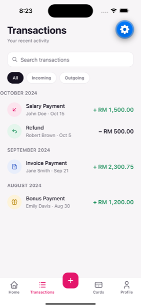
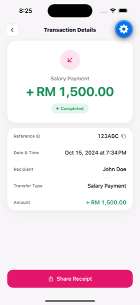
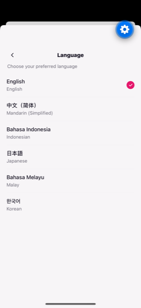
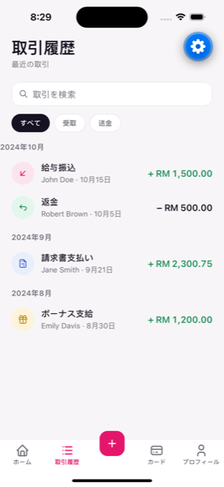

# AEON Bank — Mobile Transactions

Take-home for AEON Bank's Senior Mobile Engineer assessment: view a list of
recent transactions, drill into a transaction's details, and share the detail
page externally. Built in React Native (Expo) + TypeScript + Zustand against
the exact mock payload from the assessment brief — and, deliberately, against
the actual job description as well (see [Why this goes beyond the brief](#why-this-goes-beyond-the-brief)).

## Screenshots

All captured from a real, running build (iOS Simulator, iPhone 15 Pro — via
`npx expo start` + Expo Go, since a local native build hits an unrelated
Xcode 26.1/Swift compiler bug in Expo SDK 57's own `expo-modules-jsi`
package; see the `fix:` commit for detail). Not mockup renders.

| Transaction List                                                | Transaction Detail                                                  |
| --------------------------------------------------------------- | ------------------------------------------------------------------- |
|  |  |

| Language Switcher                                                 | List — 日本語 (live, no restart)                                      |
| ----------------------------------------------------------------- | --------------------------------------------------------------------- |
|  |  |

## Tech stack

- **Expo** (React Native, TypeScript, Expo Router for file-based navigation)
- **Zustand** for the small slice of state that's genuinely shared/persisted
  (fetched transactions; locale + theme preference)
- **i18next / react-i18next** — 6 UI locales (English, Simplified Chinese,
  Bahasa Indonesia, Japanese, Bahasa Melayu, Korean)
- **@tabler/icons-react-native** — every icon in the app, no hand-rolled SVGs
- **@shopify/flash-list** for the transaction list (recycled views)
- **Jest + React Native Testing Library** for unit tests

## Getting started

### Prerequisites

- Node.js 20+ and npm
- [Expo CLI](https://docs.expo.dev/get-started/installation/) (installed on
  demand via `npx`, nothing to install globally)
- To run on a **simulator/emulator**: Xcode (iOS) and/or Android Studio (Android)
- Alternatively, the [Expo Go](https://expo.dev/go) app on a physical iOS/Android
  device — no native toolchain required for that path

### Install

```bash
npm install
```

### Run

```bash
npm start
```

This opens the Expo dev tools in your terminal. From there:

- Press `i` to open in the iOS Simulator
- Press `a` to open in an Android emulator
- Press `w` to open in a browser (Expo for web)
- Or scan the QR code with the **Expo Go** app on a physical device

If you'd rather build a native dev client directly (skips Expo Go):

```bash
npm run ios
npm run android
```

### Test, lint, typecheck

```bash
npm test
npm run lint
npm run typecheck
```

A pre-commit hook (Husky + lint-staged) runs ESLint/Prettier on staged files
automatically.

## What's implemented

- **Transaction List** — the exact 4-record sample payload from the
  assessment, grouped by month, with All/Incoming/Outgoing filtering,
  debounced search, pull-to-refresh, and loading/empty/no-results/error states.
- **Transaction Detail** — reference ID, date/time, recipient, transfer type,
  and amount; tap-to-copy the reference ID with an accessibility
  announcement; **Share Receipt** invokes React Native's native `Share.share()`
  API, handing off to the OS's own share sheet (Messages, Mail, WhatsApp,
  whatever's installed) rather than a hand-built list of per-channel
  integrations. (Note: the native share sheet is known to be unreliable
  specifically under iOS Simulator + Expo Go — it's the standard, correct
  `Share.share()` call and works as expected on a physical device / a real
  build; this is a simulator/Expo-Go limitation, not an app bug.)
- **6 UI locales** (en / zh / id / ja / ms / ko) via a Language screen under
  Profile — switching relabels the whole app instantly, no restart, and the
  choice persists across launches.
- **Light/dark mode**, following the OS by default.
- Bottom tab bar matches the approved mockup's 5 destinations; only
  **Transactions** is a real flow — Home/Transfer/Cards/Profile-features are
  explicitly out of scope for this brief (see `docs/PRD.md`) and render an
  honest "coming soon" placeholder rather than a dead tap target or an
  invented feature.

## Architecture

```
app/                          Expo Router routes — thin, no business logic
  _layout.tsx                 Root stack: i18n/theme bootstrap, providers
  (tabs)/                     Bottom tab bar + its 5 screens
  transaction/[refId].tsx     Detail route
  language.tsx                Language switcher (modal)
src/
  features/transactions/
    types/                    Transaction, TransactionListResponse — mirror the BE sample exactly
    services/                 TransactionRepository interface + mock impl + swap-point barrel
    store/                    Zustand: raw fetched list only
    utils/                    Pure, unit-tested: currency/date formatting, direction, grouping
    hooks/                    *.hook.ts — the screen's controller (data + view-model)
    components/               Presentational only
    screens/                  *.screen.tsx — pure layout, zero business logic
  shared/
    theme/                    Design tokens (colors, type scale, spacing) — light + dark
    i18n/                     i18next config + the 6 locale JSON files
    components/               Cross-feature UI (EmptyState, Skeleton, ComingSoon)
    store/                    preferences-store (locale/theme, persisted)
mocks/                        The assessment's exact sample payload
__tests__/                    Unit tests, mirrors src/ structure
```

Every screen follows a strict `screen → hook → service` dependency direction
(a screen never fetches data or touches the store directly; a hook never
renders JSX) — this is what makes the hooks unit-testable without booting the
UI, and what keeps a future real backend integration a one-file change in
`src/features/transactions/services/index.ts` rather than a UI rewrite.

The full rationale for every one of these decisions — including two places
where later implementation deliberately diverged from the original written
plan, and why — lives in the planning docs kept outside this repo (see below).

## Why this goes beyond the brief

The assessment brief asks for a transaction list, a detail screen, and share.
This build also does: 6 locales (not required), light/dark mode, a full
design system, an OWASP-Mobile-Top-10-mapped security review, a QA test plan
with a Detox outline, and a GitHub Actions CI pipeline. That's not scope
creep — it's aimed at the actual job description this assessment is graded
against (React Native, RESTful/GraphQL integration readiness, accessibility,
CI/CD, mobile security, test automation, Agile collaboration). Every one of
those additions is traceable to a specific JD line in the planning docs.

## Planning docs

Per feedback during the review phase, the PRD, design system, engineering
plan, technical proposal, DevOps plan, QA plan, security review (red team +
blue team), and localization plan — plus the original UI mockup — live
**outside this repository**, not in a public `docs/`/`design/` folder, since
they're internal working documents rather than part of the submission itself.
